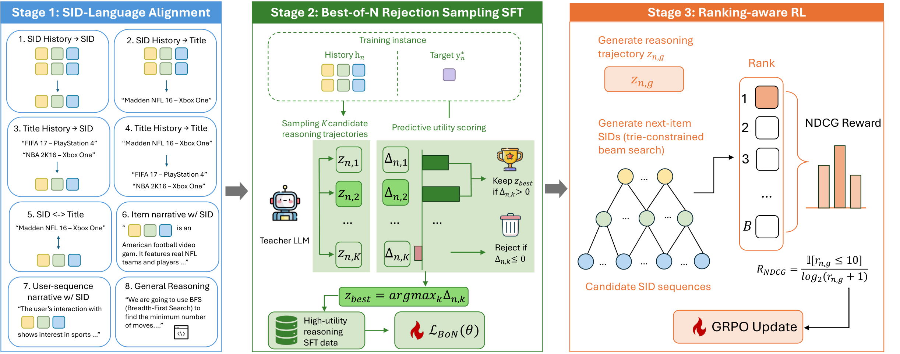

<p align="center">
  
</p>

This is the official repository for the paper: **"Learning Better Reasoning for
Generative Recommendation with Semantic IDs"**.

In the paper, we propose **Evo-Rec**, which evolves to select the chain-of-thought with
the highest measured predictive utility, then enhances the reasoning policy with
ranking-aware reinforcement learning.

> **Three stages training**: (1) *SID–language alignment SFT* over 8 complementary tasks →
> (2) *Best-of-N rejection sampling SFT* that keeps the highest-utility
> chain-of-thought per history → (3) *ranking-aware GRPO* whose reward is the
> NDCG@10 of the ground-truth SID under trie-constrained beam search.
> 
> **Evaluation**: the model drafts its reasoning, then beam search
> (B=10) over a prefix trie decodes a catalog-valid SID.

<p align="center">
  
</p>

---

## Install Requirements

```bash
cd evo-rec
pip install -r requirements.txt
```

## Data

Three Amazon Review categories. `CATEGORY` selects the domain in every script.

| `CATEGORY` | Paper name | #Items | #Train | #Val | #Test |
|---|---|---:|---:|---:|---:|
| `Video_Games` | Games | 3,858 | 49,133 | 6,142 | 6,142 |
| `Office_Products` | Office | 3,459 | 38,924 | 4,866 | 4,866 |
| `Industrial_and_Scientific` | Industrial | 3,686 | 36,259 | 4,533 | 4,533 |

Download the data from [this link](https://drive.google.com/file/d/19dzpIo_yJp7wmMqnMBquJkqLxlQrEZOA/view?usp=drive_link) and place the `data/` directory in the project root (`./`).

All data is read from `./data/` through [`data_io.py`](data_io.py). Each leaf directory holds one or more `*.parquet` shards, globbed in sorted filename order and concatenated.

```text
data/
├── general_reasoning/                    # Stage 1 (to be released upon acceptance)
└── <CATEGORY>/
    ├── catalog/                          # SID vocabulary, titles, trie 
    ├── seqrec/
    │   ├── test/                         # Evaluation
    │   └── {train,validation}/           # Stages 1-3 (to be released upon acceptance)
    ├── reasoning/                        # Stage 1 + the Step-3 scorer (to be released upon acceptance)
    ├── cot/sample_1..5/                  # Step 2 generates this
    └── rl/                               # Step 5 writes this
```

### Released checkpoints
Download the checkpoint from [this link](https://drive.google.com/file/d/1HUn3VIPOoSYc-3SAdZalKX4Zvw0dzJgu/view?usp=drive_link) and place the `checkpoint/` directory in the project root (`./`).


## Evaluation

Metrics are Recall@K and NDCG@K for K ∈ {5, 10} under full-item ranking.

```bash
CATEGORY=Video_Games \
MODEL=./checkpoint/Video_Games/stage3/final \
bash evaluation/run_eval.sh
```


## Training Pipeline

Steps 1, 3 and 4 log to Weights & Biases, so export a key once before starting. Steps 1 and 3 also honour `REPORT_TO=none` to train without it.

```bash
export WANDB_API_KEY=...
```

### Step 1: SID-language alignment SFT

```bash
bash stage1_sid_alignment/sft_Qwen3_enrich.sh Video_Games
# no argument = all three categories in sequence
```


### Step 2: Generate the K=5 teacher CoT samples

Run [`stage2_bon_sft/prompts/prompt.txt`](stage2_bon_sft/prompts/prompt.txt) K × per training row (K=5), at non-zero temperature so the samples differ. Write sample *k* to `./data/<CATEGORY>/cot/sample_<k>/` as parquet — only column `reasoning_path` is newly generated by the teacher's reasoning CoT.

### Step 3: Train the frozen CoT scorer

Single-CoT SFT on `sample_1`. The resulting model is frozen and used only to score candidates in Step 4.

```bash
CATEGORY=Video_Games bash stage2_bon_sft/sft_reasoning_activation.sh
```

Writes `checkpoint/<CATEGORY>/stage2_scorer/final_checkpoint`. 

### Step 4: Best-of-N rejection sampling SFT

One command chains score → select → train → eval:

```bash
CATEGORY=Video_Games bash stage2_bon_sft/run_best_of_n.sh
```


### Step 5: Ranking-aware GRPO

```bash
python stage3_rl/create_reasoning_rl_data.py --category Video_Games
CATEGORY=Video_Games bash stage3_rl/RL_training_script_no_kl.sh
```

### Step 6: Merge the FSDP checkpoints

Stage-3 saves sharded FSDP actors; evaluation needs a single-card HF model.

```bash
CATEGORY=Video_Games bash stage3_rl/merge_fsdp_ckpt_ALL.sh
# or one checkpoint:
bash stage3_rl/merge_fsdp_ckpt.sh ./checkpoint/Video_Games/stage3/global_step_300/actor
```

Each produces a sibling `actor_merged/` directory.

## Acknowledgement

This repo is built upon [SidReasoner](https://github.com/HappyPointer/SIDReasoner). 
